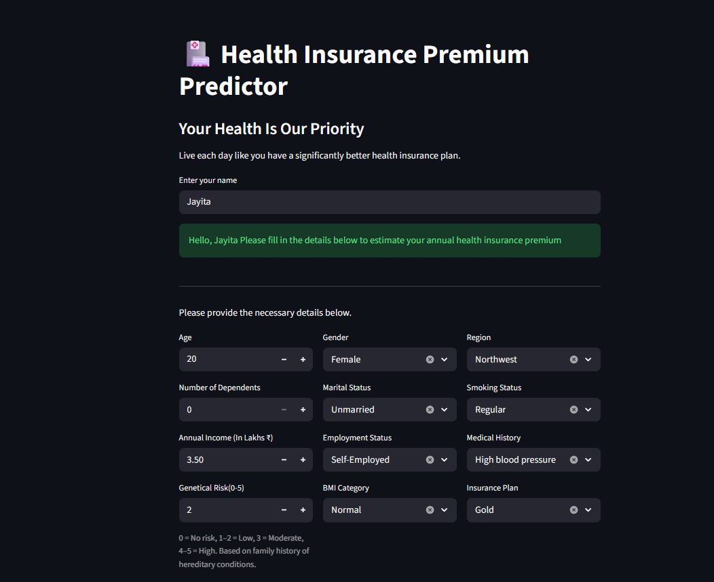
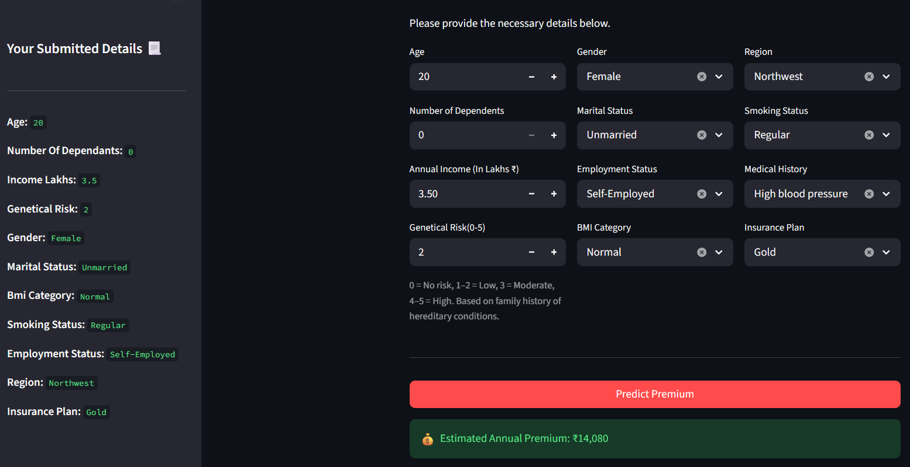

# 🏥 Health Insurance Premium Predictor

The deeper you go into ML, the more it pulls you,and nothing makes that clearer than building something end to end.

## Project Objective
- Develop a model with >97% accuracy where at least 95% of 
  predictions are within 10% of the actual value
- Deploy on cloud so underwriters can access it from anywhere
- Build an interactive Streamlit app for instant premium estimates

## Tech Stack
- **ML:** Scikit-learn, XGBoost, Pandas, NumPy
- **Frontend:** Streamlit
- **Serialization:** Joblib

## Model Results
| Age Group | Model | R² Score | Max Error |
|-----------|-------|----------|-----------|
| Age < 25 | Linear Regression | 0.988 | < 10% |
| Age ≥ 25 | XGB Regressor | 0.998 | < 10% |

## Problems I Faced and How I Solved Them

**1. Age was creating two distinct prediction patterns:**
Training a single model on the full dataset hurt accuracy,
younger and older age groups behaved very differently.

**Solution:** split into two separate models, one for age < 25 
and one for the rest, each with its own scaler.

**2. The risk score was a derived feature users can't know:**
The model expected a `normalized_risk_score` column, but no 
user can provide that directly. 

**Solution:** the backend 
computes it internally from the user's selected `medical 
history` using the same formula used during training.

**3. A training inconsistency in the scaler caused silent errors:**
The scaler was fit with an `income_level` column that was later 
dropped before the final feature set was saved. Without 
handling this, predictions would have been silently wrong 
with no error thrown. 

**Solution:** inject the missing column as 
0 temporarily, scale, then drop it before prediction.

**4. Mixing ML logic with UI code makes maintenance a nightmare**

**Solution:** clean separation, `app.py` handles only the 
interface and knows nothing about models or scaling. 
`prediction.py` handles all ML logic and knows nothing about 
the UI. Each file can change independently.

## Project Structure
```
├── app.py           # Frontend — UI only
├── prediction.py    # Backend — all ML logic
├── requirements.txt
└── files/
    ├── model_young.joblib
    ├── model_rest.joblib
    ├── scaler_young.joblib
    ├── scaler_rest.joblib
    └── columns.joblib
```

## How to Run
**1. Clone the repository**
```bash
git clone https://github.com/roy-tanmay/Health-Insurance-Premium-Prediction.git
cd Health-Insurance-Premium-Prediction
```


**2. Install dependencies**
```bash
pip install -r requirements.txt
```

**3. Run the app**
```bash
streamlit run app.py
```

## What I Learned
- End-to-end ML deployment goes far beyond model.predict()
- Training inconsistencies between notebook and production 
  are silent and dangerous, always verify your artifacts
- Clean code separation matters as much as model accuracy
- Training a model is 30% of the work. Making it actually work in production is the other 70%.

## Live Demo
[🚀 Launch App](https://tanmay-health-insurance-premium-prediction.streamlit.app/)
## App Screenshot



<<<<<<< HEAD

## Connect
**Tanmay Roy**

[LinkedIn](https://www.linkedin.com/in/tanmay-roy-/)
=======
>>>>>>> b9cb9eb8471ddb73a9009c89b7e3513f58ed0078
